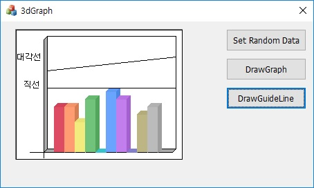

# Simple_Graph

## Env.
Visual Studio / MFC / c++14

## Description
* MFC, 선을 직접 그린 Graph

## How to use

~~~cpp
GraphImpl graph;
graph.SetSize(10); // 10개의 Item 설정
for (int i = 0; i < 10; i++)
{
	graph_.AddItem(i, static_cast<int>(randomNumber(rng))); // 임의의 값을 정의함
}

graph_.CreateGraph(static_field); // HWND static_field, 그리고자하는 대상의 핸들값 
graph_.TestDrawHorizon(); // 차트내 가로 선을 그린다.
~~~

## Result

